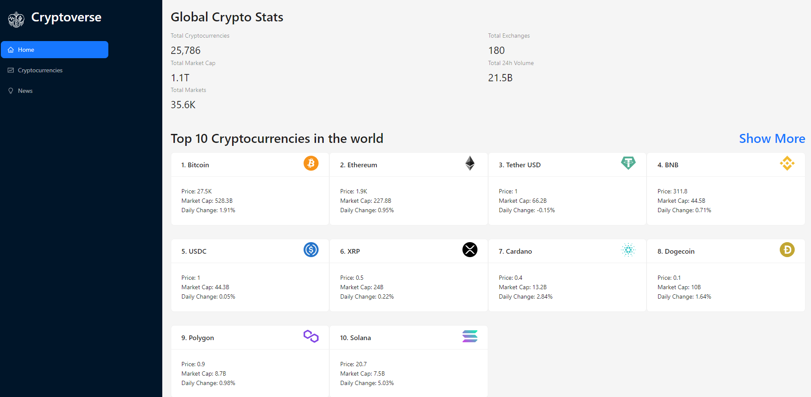

# 🚀 Cryptoverse App
Welcome to Cryptoverse, your ultimate hub for cryptocurrencies! This React-based app combines the power of RapidAPI, Redux Toolkit, and other awesome technologies to provide you with the latest news, prices, statistics, and even interactive charts for the top 100 cryptocurrencies.



## Features
- Crypto Prices: Get accurate and up-to-date prices for the top 100 cryptocurrencies. Thanks to the integration with RapidAPI's Crypto API, you can easily browse through the price information of various cryptocurrencies and monitor their performance.

- Crypto News: Stay updated with the latest news from the world of cryptocurrencies. Cryptoverse integrates with RapidAPI's Crypto News API to fetch real-time news articles, keeping you informed and in the loop.

- Crypto Statistics: Dive deep into the statistics of your favorite cryptocurrencies. Cryptoverse leverages Redux Toolkit to fetch detailed statistics such as rank, volume, market cap, and more for each crypto in the top 100 list.

- Charts: Visualize the historical price data of cryptocurrencies using interactive charts. Explore the trends and analyze the performance of different cryptocurrencies over time.

## Technologies Used
- React: A JavaScript library for building user interfaces.
- Redux Toolkit: A set of tools and conventions to simplify the Redux development experience.
- RapidAPI: An API marketplace that provides various APIs, including Crypto News API and Crypto API.
- HTML/CSS: Markup and styling for the app's user interface.
- Ant Design: A React UI library for designing beautiful and responsive components.
- Chart.js: A powerful charting library for creating interactive and customizable charts.
- Axios: A promise-based HTTP client for making API requests.

## How to Use
To use Cryptoverse, follow these simple steps:

1. Clone this repository to your local machine.
2. Install the necessary dependencies by running ```npm install``` or ```yarn install``` in the project directory.
3. Obtain an API key from RapidAPI for the Crypto News API and Crypto API services.
4. Replace the placeholders for the API keys in the respective service files (cryptoNewsApi.js and cryptoApi.js) with your actual API keys.
5. Run the app using ```npm start``` or ```yarn start```.
6. Access Cryptoverse in your browser at http://localhost:3000.
7. Explore the latest news, prices, statistics, and charts for cryptocurrencies. Enjoy!

Or .. I just deployed this project here! 🏄👉 

## Credits
This project was created following the tutorial by JavaScript Mastery on YouTube. The tutorial was instrumental in helping me understand and utilize the various technologies involved. I am grateful for the knowledge gained through this project, and I will carry it forward in my future projects.🙏

JavaScript Mastery: [YouTube Channel](https://www.youtube.com/c/JavaScriptMastery)


# Getting Started with Create React App

This project was bootstrapped with [Create React App](https://github.com/facebook/create-react-app).

## Available Scripts

In the project directory, you can run:

### `npm start`

Runs the app in the development mode.\
Open [http://localhost:3000](http://localhost:3000) to view it in your browser.

The page will reload when you make changes.\
You may also see any lint errors in the console.

### `npm test`

Launches the test runner in the interactive watch mode.\
See the section about [running tests](https://facebook.github.io/create-react-app/docs/running-tests) for more information.

### `npm run build`

Builds the app for production to the `build` folder.\
It correctly bundles React in production mode and optimizes the build for the best performance.

The build is minified and the filenames include the hashes.\
Your app is ready to be deployed!

See the section about [deployment](https://facebook.github.io/create-react-app/docs/deployment) for more information.

### `npm run eject`

**Note: this is a one-way operation. Once you `eject`, you can't go back!**

If you aren't satisfied with the build tool and configuration choices, you can `eject` at any time. This command will remove the single build dependency from your project.

Instead, it will copy all the configuration files and the transitive dependencies (webpack, Babel, ESLint, etc) right into your project so you have full control over them. All of the commands except `eject` will still work, but they will point to the copied scripts so you can tweak them. At this point you're on your own.

You don't have to ever use `eject`. The curated feature set is suitable for small and middle deployments, and you shouldn't feel obligated to use this feature. However we understand that this tool wouldn't be useful if you couldn't customize it when you are ready for it.

## Learn More

You can learn more in the [Create React App documentation](https://facebook.github.io/create-react-app/docs/getting-started).

To learn React, check out the [React documentation](https://reactjs.org/).

### Code Splitting

This section has moved here: [https://facebook.github.io/create-react-app/docs/code-splitting](https://facebook.github.io/create-react-app/docs/code-splitting)

### Analyzing the Bundle Size

This section has moved here: [https://facebook.github.io/create-react-app/docs/analyzing-the-bundle-size](https://facebook.github.io/create-react-app/docs/analyzing-the-bundle-size)

### Making a Progressive Web App

This section has moved here: [https://facebook.github.io/create-react-app/docs/making-a-progressive-web-app](https://facebook.github.io/create-react-app/docs/making-a-progressive-web-app)

### Advanced Configuration

This section has moved here: [https://facebook.github.io/create-react-app/docs/advanced-configuration](https://facebook.github.io/create-react-app/docs/advanced-configuration)

### Deployment

This section has moved here: [https://facebook.github.io/create-react-app/docs/deployment](https://facebook.github.io/create-react-app/docs/deployment)

### `npm run build` fails to minify

This section has moved here: [https://facebook.github.io/create-react-app/docs/troubleshooting#npm-run-build-fails-to-minify](https://facebook.github.io/create-react-app/docs/troubleshooting#npm-run-build-fails-to-minify)
